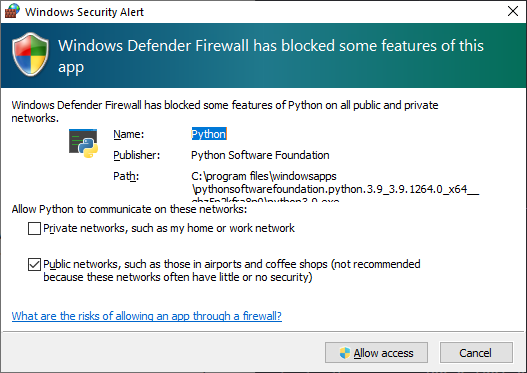

# Amazon - Web Scraper


This is a tool to automate a search in https://amazon.com.br. You can search for any text and retrieve the result to a CSV file in the order they were listed.
The properties you'll get are:

* Page_Found: the result page number which the item was found
* Product name: the exact name showed in result page
* Price: the exact price in BRL, it can be None as the page shows some items without price

:arrow_forward: ​Demonstration

## Prerequisites

Before you begin, ensure you have met the following requirements:

* You have installed the [Python](https://www.python.org/downloads/) 3.6 or greater

## Installing Amazon - Web Scraper

To install virtual environment with all required modules, follow these steps:

**Linux and macOS**

Give script permission to be executed

```bash
sudo chmod +x setup-env-linux.sh
```

Run the script

```bash
source ./setup-env-linux.sh
```

> :information_source: **Note**
>
> After running the script you must see a `(.venv)` text at the beginning of current command line. It indicates that your virtual environment is activate.
>
> If it not appears, you can try to activate virtual environment by running:
>
> ```bash
> source .venv/bin/activate
> ```

**Windows**

Run the script

```bash
.\setup-env-windows.ps1
```

> :information_source: **Note**
>
> After running the script you must see a `(.venv)` text at the beginning of current command line. It indicates that your virtual environment is activate.
>
> If it not appears, you can try to activate virtual environment by running:
>
> ```bash
> .venv\Scripts\activate.ps1
> ```

## Run Amazon - Web Scraper

To run the scraper, follow these steps:

```bash
python3 -B -m scripts.run
```

The exported CSV can be found in `csvs/` folder.

> :information_source: **Note** - Running in Windows for the first time 
>
> You can be asked to give firewall permissions to Python when running for the first time. Select Allow Access or it won't be able to connect to the Internet.
>
>  

## Configuring Amazon - Web Scraper

All configuration are available on the file `scripts/run.py`. You can change

* keywords to search for;
* number of pages to export;
* CSV delimiter and file prefix;
* which amazon domain to search for;
* which element to expect to appear for the scraper to be triggered

## Contributing to Amazon - Web Scraper

To contribute to python-amazon-webscraping, follow these steps:

1. Fork this repository.
2. Create a branch: `git checkout -b development`.
3. Make your changes and commit them: `git commit -m '<commit_message>'`
4. Push to the original branch: `git push origin python-amazon-webscraping/master`
5. Create the pull request.

Alternatively see the Github documentation on [creating a pull request](https://help.github.com/en/github/collaborating-with-issues-and-pull-requests/creating-a-pull-request).

## Contributors

Thanks to the following people who have contributed to this project:

* [@joaogcs](https://github.com/joaogcs) 📖

## Contact

If you want to contact me you can reach me at <joaogcsoares1@gmail.com>.

## License

This project uses the following license: [MIT](https://opensource.org/licenses/MIT).